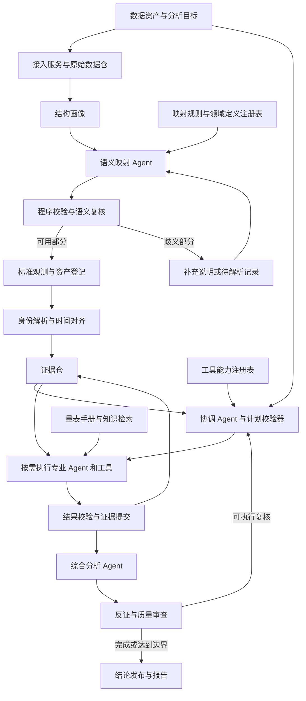

# 多源异构数据多智能体系统架构设计

日期：2026-09-07  
状态：架构设计草案，尚未实施  
依据：当前项目主分析链、导出器、报告生成器、影像工具、独立 RAG 原型，以及本地 5 篇论文的阅读记录。

## 1. 设计结论

建议将项目升级为：**面向已知数据类型、支持可变输入结构的证据驱动多智能体分析系统**。

核心组成：

> 可变原始数据 → 数据理解与映射 → 可追溯证据 → 能力驱动的任务调度 → 专业分析 → 定向质询与复核 → 有依据的综合报告。

最重要的变化是：**Agent 面向语义概念和证据工作，不直接依赖原始字段名、表单 ID 或 JSON 层级。**

系统包含两个闭环：

1. **数据接入闭环**：发现结构、理解语义、生成映射、验证映射、复用已验证适配方案。
2. **分析协作闭环**：根据目标和可用证据安排任务、形成观点、识别分歧、定向补查、更新结论。

这两个闭环共享证据来源和版本，但职责分离。数据语义没有确定时，不应让后续多个 Agent 对同一个错误映射反复讨论。

本文按“数据类型可限定；字段结构不固定；有时能提供字典或量表说明，有时只能提供数据”的情况设计。第一阶段仍以单患者研究分析为目标；队列统计、因果推断和经过校准的个体风险预测是不同任务，需要额外能力和验证。

## 2. 当前项目的问题究竟在哪里？

以下是代码层面的发现，不是对现有模型预测性能的实验结论。目前没有完成独立标注集评测，不能据此断言系统在所有任务上完全无效。

| 当前实现 | 实际限制 | 新架构的处理 |
|---|---|---|
| `main.py` 读取固定患者 JSON | 无通用输入清单，假定导出器已经完成准备 | 输入清单支持多份异构数据资产 |
| `export_patient_agent_json.py` 固定 `FORM_CONFIGS`、表单 ID 和日期字段 | 与一个 RWE 项目的表结构耦合 | 数据源连接器与语义适配器分开 |
| `DataQualityAgent` 深复制数据，检查固定五类量表 | 尚非跨结构标准化；“未上传”易被当成全局质量失败 | 类型级检查 + 任务级数据需求 |
| `CognitiveAgent` 直接读取“MMSE总分”等键 | 字段改名、嵌套、长表就可能无法分析 | 查询标准概念，使用量表定义注册表 |
| `FunctionalStagingAgent` 遍历 FAQ 中除几个键外的字段 | 新增备注、填表人等字段可能被当作功能条目 | 明确区分题目、总分、元数据 |
| `LongitudinalAgent` 依赖固定四类序列与方向 | 未知量表不支持；输入顺序和可比性依赖上游 | 通用时间序列服务 + 量表可比性约束 |
| `ClinicalSynthesisAgent` 固定条件判定，影像 / 标志物主要进入解释 | 多源输入尚未充分影响各项判断与复核路径 | 分析结论按表型、功能、病因证据分别整合 |
| 固定 `for agent in self.agents` | 没有任务依赖调度、分歧反馈、局部重试 | 显式状态图 + 有界复核子图 |
| 报告阶段才分配 E001 等顺序 ID | 证据缺少跨运行稳定身份；同记录不能可靠追踪修订 | 入库阶段建立来源定位与版本身份 |
| `decision_basis` 校验主要检查引用 ID 是否存在 | 不要求每条结论有引用，也不验证证据是否支持该句 | 结论级引用、数值校验和语义支持审查 |
| TXT 报告路径再次汇总固定五类 Agent | 多个报告出口可能有不同的判断依据 | 统一发布产物，MD / JSON / TXT 为不同视图 |
| `test/agent_app` 是独立 RAG 应用 | 不是主分析链中已经接通的知识 Agent，也不是当前系统的完整测试集 | 抽出检索服务，再按任务接入 |

还需要区分真实能力与旧示例：`tools/mri_tool.py`、`tools/pet_tool.py` 返回固定结果，当前主流程使用的是 `DiamondTool`。新工具注册表必须排除这些占位实现，不能因文件存在就宣称具备 MRI 萎缩或 PET 定量能力。`KnowledgeAgent` 仍采用旧接口，且未在当前编排中启用。

已有资产可保留：确定性计算优先的原则、量表和质控逻辑、DiaMond 调用链、报告证据引用的初步设计、RAG 的混合检索与来源元数据。

## 3. “结构不固定”的需求边界

### 3.1 四类变化应分别处理

| 场景 | 示例 | 系统应如何处理 |
|---|---|---|
| 相同语义，表示不同 | `总分`、`total_score`、`result.value`；宽表、长表、嵌套 JSON | 建立映射后使用同一分析工具 |
| 相同量表，不同版本 / 计分条件 | 语言、版本、教育校正、总分类型变化 | 识别版本和计分规则；不得默认合并 |
| 新量表，提供完整说明 | XX 量表有题目、评分公式、方向与适用条件 | 登记新量表定义，复用通用工具；特殊计分另做插件 |
| 新量表，无足够语义说明 | 只有 `a1`、`a2`、`score=18` | 保留原值、分析结构和完整性；不臆造量表身份、方向或阈值 |

**未知结构通常可以适配，未知语义不一定能够自动恢复。** 例如只看到 0–30 的取值，无法确定它一定是某一量表，也无法确定是否已做教育校正。

### 3.2 可以固定什么？

- 初始数据类型：量表 / 问卷、实验室检测、遗传结果、影像资产、临床文本、人口学与访视元数据。
- 共同身份：来源、项目、受试者、记录、时间和版本。
- 通信协议：证据、发现、任务、质询、修订、报告。
- 工具能力边界：支持什么输入、产生什么输出、何时允许执行。

### 3.3 什么不应写死？

- 原始列名、表名、RWE 表单 ID、字段路径、列顺序。
- 一个患者一定具备哪些量表。
- 所有量表都是 0–30 分、越高越好、条目简单相加。
- 同一自然日的数据必然属于同一次测量；最近一次数据必然可互相比对。
- 所有异常都能推导到同一个疾病标签。

第一版格式范围建议为 JSON、CSV、Excel 和现有影像路径；文本 / PDF 抽取在下一阶段扩展。支持“多种结构”不等于第一天支持所有文件格式，格式解析与语义适配应分别扩展。

## 4. 总体架构



实现上采用**模块化单体**，进程内服务加独立影像工作进程即可。图中是逻辑模块，不代表每个模块都需要独立部署或一次 LLM 调用。

### 4.1 数据平面

负责读取、保存、校验、转换、查询与计算：原始数据、映射记录、观测、时间索引、工具产物、证据和来源关系。

### 4.2 控制平面

负责目标、任务、依赖、路由、预算、复核与结束条件。Agent 可以提出计划和修订，但必须通过能力、输入、预算和状态校验后执行。

### 4.3 为什么使用“共享证据仓 + 显式编排”？

证据仓使多个 Agent 使用同一份可追溯事实；显式编排使执行顺序、缺失处理和重试可控。第一版不采用完全自由的群聊调度，也不让所有 Agent 收到每一条数据更新自动反复运行。

## 5. 数据接入闭环

### 5.1 连接器只负责取到数据

`RWEConnector`、`JsonLoader`、`CsvLoader`、`ExcelLoader`、`ImagingAssetLoader` 只负责读取来源、保留原值和定位，不直接解释“认知是否下降”。

RWE 连接器尽量读取表单元数据与字段字典。当前 API 是否提供这些能力需要后续核对；若不提供，可接受外部配置描述表单，不继续把表单 ID 写在分析 Agent 内。

Excel 需要保留工作表、表头层级、行列位置；JSON 需要保留对象路径和数组位置；多表数据需要保留候选关联键。大型文件按数据集分块处理，不把整个数据集塞给 LLM。

### 5.2 结构画像服务

程序产生 `SourceProfile`，包括：

- 格式、表 / 工作表 / 对象路径、字段结构、实际类型和声明类型。
- 缺失率、重复率、取值分布、分类值、范围和格式错误。
- 嵌套数组、宽表 / 长表、按访视展开的列、候选主键和关联关系。
- 数据字典、标题、量表名称、版本等可用语义线索。
- 结构指纹及关键元数据指纹。

LLM 可读取字段说明和有代表性的少量样本；验证必须扫描全量数据或明确分块覆盖，不能只看前三行后宣布整个数据集已正确映射。

### 5.3 SchemaMappingAgent

输入画像、字典、已有映射、领域定义，输出**声明式映射方案**，至少包含：

```text
源选择器 → 目标概念
记录展开方式、患者键、访视键、事件时间
值解析 / 枚举映射 / 单位转换
量表身份 / 版本 / 题目角色候选
证据依据、未决歧义、需要的补充说明
```

优先顺序是已验证的同来源映射、明确字典、可核验的量表说明、已有别名与语义候选。字段名相似只是线索；不应凭模型自报的 0.95 置信度自动通过。

### 5.4 映射执行与验证

映射使用受限算子：`select`、`explode`、`unpivot`、`join`、`parse_number`、`parse_date`、`map_enum`、`convert_unit`。算子由程序实现，LLM 选择参数；不直接执行模型生成的任意 Python / SQL。

程序校验包括类型、范围、行数守恒、展开数量、主键唯一性、关联基数、未匹配记录、日期解释和单位换算条件。语义复核检查总分是否误认作分项、测量时间是否误认作录入时间、同名指标的平台 / 标本是否一致。

验证不能保证凭空补全语义。遇到两个合理但无法区分的解释时，保留候选并隔离受影响字段；独立可用的数据继续处理。用户补充的是事实说明，而不是每次运行都要重新批准系统执行。

### 5.5 适配方案的状态与复用

```text
proposed → validated → active
     ↘ needs_metadata
active → drift_detected → revalidate → active / suspended
```

`validated` 是校验通过，`active` 是满足接入策略后可复用。已知映射可自动复用；新量表规则或无法消除的语义歧义需要对应资料，不能靠等待时间自动消失。

复用范围包含来源系统、项目、量表身份、版本及元数据签名。同名同结构但枚举编码、单位或评分版本变化，也必须触发漂移检查。新数据批次仍运行基本校验。

## 6. 三种结构如何成为同一种语义？

以下为虚构 XX 量表示例。假定用户提供说明：`总分 / total / TOTAL` 均表示该量表同一版本的未校正总分，日期均为测量日期。

### 输入 A：宽表记录

```json
{"受试者编号":"P001","测评日期":"2026-06-01","量表":"XX","版本":"v1","总分":18}
```

### 输入 B：嵌套结构

```json
{"subject":{"id":"P001"},"visits":[{"at":"2026-06-01","forms":[{"name":"XX","version":"v1","result":{"total":18}}]}]}
```

### 输入 C：长表

```text
subject_id,visit_date,instrument,version,item,value
P001,2026-06-01,XX,v1,TOTAL,18
```

它们由不同映射产生同一种业务观测，例如：

```json
{
  "observation_id": "obs-example-001",
  "subject_ref": "project-demo:P001",
  "assessment_ref": "assessment-example-001",
  "data_type": "assessment",
  "concept_id": "instrument.xx.v1.total.raw",
  "value": {"kind": "number", "number": 18, "unit": "score"},
  "event_time": {"value": "2026-06-01", "precision": "day", "role": "measurement"},
  "qualifiers": {"instrument_id": "xx", "version": "v1", "score_kind": "raw"},
  "lineage": {"source_id": "source-A", "source_record": "row-1", "selector": "总分", "mapping_version": "map-A-v1"},
  "validation": {"mapping_status": "validated", "interpretation_status": "rules_missing"}
}
```

示例 ID 仅用于说明；真实来源分别有自己的 lineage，不能因为值相同就合并为同一条测量。

只有字段含义被确认时，才能使用上述标准概念。如果无法确认“总分”的含义，应保留 `source_local.unresolved_score` 及候选概念；如果确认总分但没有计分方向 / 阈值，仍可保留观测，却不能解释为正常或异常。

## 7. 稳定内部协议：小核心 + 类型扩展

不设计一个塞满所有可能字段的大 JSON。固定少量公共字段，使用按类型校验的扩展对象，并保留未映射原始内容。

| 对象 | 作用 | 关键内容 |
|---|---|---|
| `SourceAsset` | 不可变原始来源 | 来源 URI、内容 hash、项目、取得时间、解析器版本 |
| `SourceProfile` | 结构与数据画像 | 字段、类型、分布、关联、结构指纹 |
| `MappingSpec` | 可复用适配方案 | 输入选择器、算子、目标概念、条件、版本和验证依据 |
| `SubjectLink` | 身份对应 | 来源内患者 ID、项目命名空间、对应关系和依据 |
| `Observation` | 某次测量或抽取事实 | 主体、概念、值、时间、上下文、原始定位 |
| `AssessmentInstance` | 一次完整量表实例 | 量表版本、题目、分项、总分、计分和校正状态 |
| `ImagingAsset` | 影像登记 | 检查与序列 ID、模态、序列 / 示踪剂、日期、空间信息、文件引用 |
| `Evidence` | 可供推理引用的依据 | 来源观测 / 工具产物、生成方式、版本、适用范围 |
| `Finding` | Agent 的分析判断 | 命题、支持 / 反对证据、限制、可解释程度 |
| `Task` | 可执行分析请求 | 目标、能力、输入证据、依赖、预算、预期产物 |
| `Challenge` | 需要解决的具体质疑 | 被质疑 finding、证据、分歧类型、建议复核任务 |
| `Report` | 发布快照 | 采用的 finding / evidence、遗漏与限制、运行版本 |

`value` 应是带类型的联合对象，支持数值、分类、文本、区间、比较符号（如 `<0.1`）、缺失原因和资产引用。不能把“小于检出限”转换为 0.1，也不能让 Python 的布尔值被当成合法量表分数。

### 7.1 来源和版本

保留两种身份：逻辑记录身份与修订版本。一个来源记录被更正时，产生新版本并引用 `supersedes`，旧报告仍能定位旧输入。

来源定位按格式保存到单元格、JSON pointer、文本页 / 段落 / 字符区间或影像序列。派生结果记录输入观测 ID、工具参数、模型 checkpoint、预处理版本和运行 ID。

### 7.2 时间与身份不是普通字段映射

- 患者 ID 要带来源 / 项目命名空间；跨来源合并需明确对应表或可验证连接键，不能只凭姓名相近合并。
- 保留测量时间、录入时间、采样时间、报告时间和系统可用时间，不都压成 `visit_date`。
- 区分缺日期、月级日期、精确日和相对访视；不能将月份自行补成某一天。
- 纵向比较按相同量表版本、评分类型、单位及上下文分组；不存在有效换算规则时不合并。
- 跨模态比较窗口由具体任务配置；窗口内只是可比较候选，不代表同一临床状态。
- 回顾性预测设置 `as_of` 和可用时间截止，排除未来记录及基于未来数据生成的派生结果。

## 8. 量表定义与工具注册：新量表不等于新 Agent

### 8.1 InstrumentSpec

量表注册表描述语义规则，而不是数据库字段：

```yaml
instrument_id: xx
version: v1
domain: cognition
definition_status: incomplete
items: []
score_definitions:
  total_raw:
    source_role: reported_total
    direction: unknown
    valid_range: null
    computation_rule: null
    missing_item_policy: unknown
interpretation_rules: []
comparability_rules: []
definition_sources: []
```

后续根据手册补全题目、编码、反向题、权重、缺项规则、适用人群、校正方式与出处。原始总分、计算总分、校正总分分别保存，不能覆盖原值。

复杂计分不一定能由配置表达。例如特殊分期规则、跳题和非线性组合应使用版本化 Python 插件，LLM 不现场发明算法。

### 8.2 按能力分级支持未知量表

| 已掌握信息 | 允许做什么 | 尚不能做什么 |
|---|---|---|
| 只有原始结构 | 保存、定位、缺失与类型检查 | 确定量表身份、正常范围 |
| 明确量表与同一评分类型 | 展示已报告分数；满足可比条件时描述数值变化 | 缺方向时不能说改善 / 恶化 |
| 有可靠计分定义 | 计算 / 核验得分，处理缺项和校正 | 未有解释规则时不能给疾病判断 |
| 有经核验的解释规则和适用条件 | 对适用数据给出有条件解释 | 超出人群、版本或规则范围的推断 |

这种分级使新数据立即获得部分价值，同时明确系统能力边界。

### 8.3 CapabilitySpec

每个工具声明 `capability_id`、输入类型、前置条件、输出、版本、资源需求、失败码和验证状态。

示例能力：`assessment.validate`、`assessment.compute_score`、`series.describe`、`series.compare`、`imaging.diamond.predict`、`text.extract_observations`、`knowledge.retrieve`。

`imaging.diamond.predict` 必须要求兼容的 MRI / PET 类型、正确患者关系和模型预处理条件；存在两个文件路径只是起点。当前适配器选择切片最多的序列，并写入 T1 / FDG 路径，未来需要按实际元数据验证，不能把任意 PET 当作 FDG。

未经验证的工具状态为 `experimental` 或 `disabled`；占位工具不登记为可用能力。

## 9. Agent 分工

Agent 是职责，不要求每个职责使用不同基础模型。涉及解析、数值计算、校验和状态更新的工作尽量由程序执行。

| 角色 | 输入 | 输出 | 是否使用 LLM |
|---|---|---|---|
| 数据理解 Agent | 结构画像、字典、历史映射 | 映射候选、语义疑问 | 新结构时按需 |
| 映射复核服务 | 候选映射、全量校验统计 | 通过 / 部分通过 / 待说明 | 程序为主，语义复核按需 |
| 协调 Agent | 分析目标、证据目录、能力清单 | 分析计划、复核任务 | 按需；计划必须程序校验 |
| 量表分析 Agent | 已识别量表实例和规则 | 得分核验、维度分析、限制 | 工具计算 + 解释 |
| 纵向分析 Agent | 可比较的观测序列 | 变化、趋势、时间覆盖与不确定性 | 统计程序 + 解释 |
| 标志物 / 遗传分析 Agent | 测量、平台、标本、规则 | 描述和适用条件下的解释 | 工具 + 解释 |
| 影像分析 Agent | 合格影像资产、模型能力 | 模型预测、质量与来源证据 | 专业模型为主 |
| 文本分析 Agent | 原文与来源定位 | 带否定、时间和主体的观测 | 需要抽取能力 |
| 知识 Agent | 精确问题、量表 / 指标上下文 | 可引用规则候选、适用条件 | 检索 + 有据提取 |
| 综合分析 Agent | 专业发现和证据覆盖 | 分维度候选结论 | LLM + 输出约束 |
| 反证审查 Agent | 候选结论和相关证据 | 具体质疑、反例、替代解释 | LLM 辅助，硬校验程序化 |
| 发布校验服务 | 最终候选报告 | 可发布结论与限制 | 程序优先 |

认知与功能可作为量表分析 Agent 的领域策略，复用同一执行器；是否保留两个名称是组织选择。无需为每一个新增量表复制一个 Python Agent 类。

## 10. 协调 Agent 怎样决定下一步？

### 10.1 先确定分析目标

首版支持明确任务类型：

- 数据可用性与质量盘点。
- 单次量表 / 检测解释。
- 同一患者的纵向变化。
- 多源证据综合及差异解释。

“分析这名患者”默认输出证据盘点、可用的专业分析、综合发现和数据缺口，不默认强制给出疾病概率。

### 10.2 从证据和能力生成计划

协调器先查询可用资产及语义状态，再匹配能力：

```text
发现三个 XX 量表同版本总分 + 有测量日期
    → 计划可比性检查和纵向描述
发现 MRI，缺 PET，只有 MRI+PET 模型
    → 影像预测任务标记 unavailable，不伪造单模态能力
发现新量表但没有解释规则
    → 可先做结构和分数呈现；发起规则检索任务
发现两个来源的总分不一致
    → 查询评分类型、校正和日期后决定是否构成冲突
```

任务是目标驱动的，只有实现目标需要的数据才成为必需项。不因为没有某个与本次问题无关的量表就判整个患者质量失败。

### 10.3 Task 协议示例

```json
{
  "task_id": "task-review-007",
  "run_id": "run-example",
  "kind": "resolve_score_discrepancy",
  "goal": "确认两条分数是否分别为原始分与校正分",
  "capability": "assessment.validate",
  "input_refs": ["obs-17-v1", "obs-21-v1"],
  "depends_on": ["task-map-003"],
  "requested_by": "challenge-002",
  "expected_output": "AssessmentValidationResult",
  "completion_condition": "给出有来源的差异原因，或明确缺少哪项说明",
  "limits": {"max_attempts": 2, "max_llm_calls": 1},
  "status": "pending"
}
```

先检查能力存在、输入合格、依赖完整、资源和预算可用，再允许执行。未满足语义条件为 `needs_metadata`，不当作网络错误无限重试。

### 10.4 并行与局部重算

量表、实验室和影像任务在条件满足时可独立执行；纵向统计等待相关观测准备好，整合等待必需任务完成或终态失败。

修改一个映射或补充一个资料后，只重算依赖它的证据和发现。依赖关系由程序维护，不能靠 Agent 记忆哪些结果需要更新。

## 11. 怎样进行真正的协作？

### 11.1 专业输出从“段落”变成“可质询发现”

```text
finding_id
claim：具体命题
scope：患者、时间、量表 / 指标及版本
supporting_evidence_ids
opposing_evidence_ids
assumptions
limitations
status：supported / tentative / unresolved / withdrawn
requested_checks
```

“认知下降”这种宽泛命题应拆分为可核查的内容，例如“同版本分数在两个测量时点减少 3 分”。是否具有临床意义是另一个需要规则和背景证据的命题。

### 11.2 把差异分类，再选择复核者

| 差异类型 | 例子 | 优先处理 |
|---|---|---|
| 结构 / 映射问题 | 总分映成分项；录入日期映成测量日期 | 数据理解与映射复核 |
| 计分差异 | 原始分和校正分不同 | 量表工具与定义 |
| 时间不可比 | 早期量表与多年后影像 | 纵向对齐服务 |
| 平台不可比 | 同指标不同标本 / 方法 / 单位 | 检测上下文与规则 |
| 模型分歧 | 同影像多模型预测不同 | 模型输入、适用范围和质量检查 |
| 跨领域证据差异 | 功能表现与影像模型标签不同 | 综合分析及替代解释 |
| 真正缺证 | 无评分说明、无检查日期 | 检索或请求说明，保留限制 |

跨领域结果不同不一定互相矛盾。功能、认知、影像研究分类和生物学证据分别表达不同维度，不能简单多数投票得到统一诊断。

### 11.3 一个完整的协作案例

虚构输入：A 表记录 XX 总分 18；B JSON 记录 `adjusted_total=19`；两者属于同一次测评。

1. 数据映射初步识别两个分数字段，保留评分类型信息。
2. 量表 Agent 标记存在分数差异；若已明确评分类型，则直接报告原始分 / 校正分，而不创建伪冲突。
3. 若字段含义仍不明确，反证审查提出“是否是校正分”的具体质疑并引用两条记录。
4. 协调器安排知识 Agent 查找该来源的评分说明、映射服务复核定义。
5. 若说明确认存在一分校正且条件满足，形成“差异有解释”的修订，两个原值保留；若无依据，保持未解决。
6. 纵向 Agent 只比较同一种评分类型，综合报告引用这一处理过程。

这类闭环的效果可以验证：识别了一个语义差异，避免产生错误趋势。相比让全部 Agent 轮流发表意见，它有明确输入、动作和结果。

### 11.4 终止与预算

第一版建议最多两轮定向复核、同一任务最多两次技术尝试，具体预算可配置。以下任一情况停止相关分支：

- 质疑已被证据解决。
- 没有新的证据、可用工具或可执行动作。
- 缺少外部说明，记录 `needs_metadata`。
- 已达到时间、调用或 token 预算。

停止时保留未解决事项。区分 `completed`、`completed_with_limitations`、`needs_metadata`、`failed`，不把预算耗尽伪装为完成。

## 12. 证据仓、知识库与运行状态

### 12.1 三种存储分开

- **原始数据仓**：只读原始资产或快照，保存内容指纹与来源。
- **业务证据仓**：观测、映射、工具结果、发现、关联与修订；支持精确过滤和依赖查询。
- **知识库**：量表手册、数据字典、检测说明、文献和规则出处；检索结果不是患者观测。

原型推荐本地文件 + SQLite。影像及大文件存文件仓，数据库存引用。多人多任务部署后可迁移 PostgreSQL / JSONB，存储接口保持不变。

向量检索只用于知识和文本候选发现，不能代替患者身份、数值、时间和来源的精确查询。跨患者检索必须显式限定项目与主体，不能把其他病例混入当前证据。

### 12.2 共享状态写入规则

Agent 读取指定快照，返回待提交产物；证据服务验证后统一提交，避免多个 Agent 原地修改同一个大字典。

结果是追加或版本更新，不能覆盖他人原始观测。每个写入带 `run_id`、`task_id`、输入版本和幂等键。状态机持有引用与任务摘要，不反复复制完整病历和影像到上下文。

### 12.3 缓存与复现

工具缓存键包含输入内容 hash、映射版本、领域规则版本、工具 / 模型与预处理版本、参数。LLM 产物另记录模型、提示词版本和配置，复跑结果可能不同，缓存复用须显式标记。

当前 DiaMond 缓存主要按路径与 checkpoint 路径生成标识，设计上要补内容和预处理版本，避免文件内容变化但路径不变时继续复用旧结果。

每份报告绑定运行快照；校正源数据后创建新报告版本，并使下游旧发现标记失效。不能更新一个观测，却让报告继续声称使用最新数据。

## 13. 工程方案与文献对应

### 13.1 技术选择

- Python 继续承载核心逻辑；Pydantic / JSON Schema 用于业务对象与接口校验。
- LangGraph 承载任务状态、条件路由、并行分支及有界反馈；自有证据仓承载业务事实。
- SQLite + 文件仓用于本地原型；影像任务单独工作进程，设置超时与资源并发限制。
- 复用现有 DeepSeek 客户端，按不同职责配置提示词，不要求先引入多家基础模型。
- 将现有 RAG 封装为知识查询服务；检索资料作为外部数据处理，不允许文档内容改变工具权限或系统执行规则。

LangGraph 官方文档支持状态、节点、条件边和并行更新；checkpointer 用于运行状态恢复，不能替代领域证据存储，也不能替代外部工具幂等控制。技术接口以实施时锁定的版本为准。[Graph API](https://docs.langchain.com/oss/python/langgraph/graph-api)、[Persistence](https://docs.langchain.com/oss/python/langgraph/persistence)

这只是初版工程选择，不需要同时接入 LangGraph、AutoGen、Flock 多套运行框架。黑板思想可以通过证据仓实现。

### 13.2 五篇论文分别提供什么？

| 文献 | 本设计采用的机制 | 不直接照搬的部分 |
|---|---|---|
| TradingAgents | 专业报告、结构化状态、结论与审查分工、有限讨论 | 固定正反立场、所有案例都辩论、以投票代替证据适用性 |
| ColaCare | 让专业模型与特征证据进入 Agent，异议推动报告修订 | 完整监督融合网络；没有训练集时不承诺预测增益 |
| MedAgent-Pro | 计划步骤、输入条件、工具执行、失败阻止后续推断 | 完全依赖 VLM 进行可靠性判断；以生成权重冒充校准概率 |
| ADAgent | 能力注册、按任务和可用模态选工具、多模型分歧管理 | 将占位或不兼容模型当成真实工具；将多数预测当独立证据 |
| CARE-AD | 原始文本抽取、纵向画像、专科视角 | 未经训练和验证就宣称具备长期风险预测能力 |

**上述论文没有直接解决本项目所有动态字段适配问题。** 本设计中的结构画像、声明式映射、语义注册表和漂移验证是为你的需求补充的数据工程设计，应作为独立模块验证。

详细论文事实与页码见[文献清单](<D:/Python Project/Multi-agent/文献/文献清单.md>)。

## 14. 推荐目录结构与迁移方式

以下为规划目录，尚未创建这些模块。

```text
src/multiagent/
  contracts/       资产、映射、观测、证据、任务、发现协议
  ingestion/       JSON、CSV、Excel、RWE、影像连接器
  profiling/       结构与数据画像、漂移检测
  mapping/         映射 Agent、算子、校验、方案注册
  registry/        量表定义、工具能力、规则适用条件
  evidence/        存储、来源、身份、时间索引、依赖失效
  tools/           计分、统计、影像、检索与文本抽取
  agents/          专业分析、协调、整合、反证
  orchestration/   数据接入图、分析图、复核图、预算与恢复
  reporting/       统一报告模型、校验、MD/JSON/TXT 渲染
  evaluation/      结构泛化、证据正确性、协作消融
configs/
  mappings/        来源专属映射
  instruments/     量表和版本定义
  capabilities/    已验证工具能力
  policies/        时间窗、资源预算、接入策略
tests/
  fixtures/        合成的多结构数据和人工核对案例
  mapping/         映射与漂移测试
  analysis/        能力与证据测试
  workflows/       反馈、失败、恢复、缓存失效测试
```

先新增 v2 入口，与旧流程并行对比，避免一次重写全部业务：

1. 旧 `schema_version=2.0` 患者 JSON 成为一个受支持的数据源适配器。
2. 现有量表计算逻辑提取成工具和配置；去掉对原始中文字段的直接依赖。
3. DiaMond 先封装为一个注册能力，完善输入校验与缓存键，再扩展模型。
4. 现有报告生成逻辑接到统一 `Report`，停止各出口独立做最终判断。
5. 独立 RAG 原型按服务抽取；新验证测试放在 `tests/`，与现有 `test/` 应用区分。

## 15. 分阶段实施与验收

### 阶段 A：先证明结构变化不会破坏分析

范围：JSON / CSV / Excel、量表总分和条目、已知量表的多种布局、旧数据适配器。

交付：协议、结构画像、映射算子、量表定义注册表、接入报告、确定性统计。

验收建议：

- 同一批合成事实用至少 3 种结构表达，得到等价的业务观测和计算结果；来源定位允许不同。
- 字段改名、嵌套、长宽表转换、列顺序变化、新增备注不改变分析含义。
- 日期歧义、枚举编码变化、版本不明时明确报告，不能静默采用错误解释。
- 新的已知量表结构只新增 / 更新映射，不修改专业 Agent。
- 新量表缺规则时仍可接入和盘点，但不输出臆造解释。

这是优先级最高的一步。它解决的是你当前最明确的痛点，完成后才值得增加更多推理环节。

### 阶段 B：证明多个 Agent 能通过反馈纠正具体问题

范围：量表、纵向、现有影像能力；协调、整合和一个反证角色。

交付：任务依赖、标准发现、质询与局部重算、运行记录。

验收建议：用人工设计的原始分 / 校正分差异、时间错配、量表版本差异、影像输入不兼容案例，检查是否识别正确问题、指派正确复核任务并改变相关发现。无新证据时能够停止，缺失一类数据时其他分支正常完成。

### 阶段 C：扩展文本、知识与增量更新

范围：临床文本、手册与字典、按原句定位的抽取、规则候选审核、映射漂移。

交付：文本观测、知识出处、映射复用与规则版本管理。

验收建议：抽取正确性、否定和时间识别、规则适用条件、更新数据后下游失效与重算范围。

### 阶段 D：评估预测任务

仅在明确目标标签、训练 / 验证 / 测试划分和可用模型后实施。可考虑 ColaCare 式融合或其他预测器，但不把“报告更完整”作为预测能力提高的证据。

## 16. 怎样衡量是否有效？

### 16.1 数据结构泛化

按**来源系统和结构模板**留出测试集，不能只随机拆分同模板中的行。比较人工配置映射、规则匹配、LLM 映射和混合方案。

指标：字段语义映射正确率、记录 / 患者关联正确率、自动接入覆盖率、未决比例、静默错误率、人工修订量、已知映射复用率和新增结构适配成本。

同时报告正确率与覆盖率：全部拒绝不能算结构理解优秀；全部强行映射也不能算自动化成功。

### 16.2 证据和分析

检查数值与原文一致性、来源定位、派生计算、时间可比性、证据引用支持程度、未知 / 缺失状态表达。建立真值样例，特别覆盖：

- 原始分与校正分、总分与分项、0 与缺失、重复测量。
- 日期顺序变化、同日多条记录、部分日期、不同量表版本。
- 检测单位、平台、标本与小于检出限。
- 错患者关联、未来信息、影像模态 / 序列不匹配。
- 文件路径不变但内容变化、映射或模型版本更新、并行任务重试。

### 16.3 协作净贡献

固定输入证据、工具与模型，比较：

| 组别 | 流程 |
|---|---|
| A | 当前项目流程 |
| B | 新标准证据 + 单个整合 Agent |
| C | 新标准证据 + 多专业分析 + 整合，无反馈 |
| D | C + 定向质询和复核 |
| E | D + 自适应调度 |

比较分歧解决正确率、误报分歧率、无依据结论率、关键证据覆盖、调用 / token / 耗时。增加同预算对照，记录不同运行的波动；检验“更复杂”是否确实增加正确性或降低成本。

当前阶段优先目标应是：**同一事实换结构后结果稳定，数据不足时诚实降级，出现可解决差异时能通过协作修正。** 这三项有可测量的成果，也是后续预测研究的基础。

## 17. 暂定决策与后续需要确认的信息

本设计已作的决定：不固定源字段；固定类型化内部协议；映射和计分规则分别管理；采用有限协作闭环；保留已有真实工具；第一阶段不训练新预测网络。

实施前需要根据实际样例细化：

- 各来源能否提供字段字典、量表名称 / 版本和评分说明。
- 输入主要来自 RWE API、文件上传还是数据库；能否取得跨来源患者对应关系。
- 首批需要支持的量表与三种以上真实结构样例。
- 分析目标优先是质控、描述、纵向比较还是有标签预测。
- 影像模态、示踪剂、序列及预处理条件是否可核验。

这些信息用于细化配置和能力范围，不改变“数据接入闭环 + 分析协作闭环”的总体架构。
