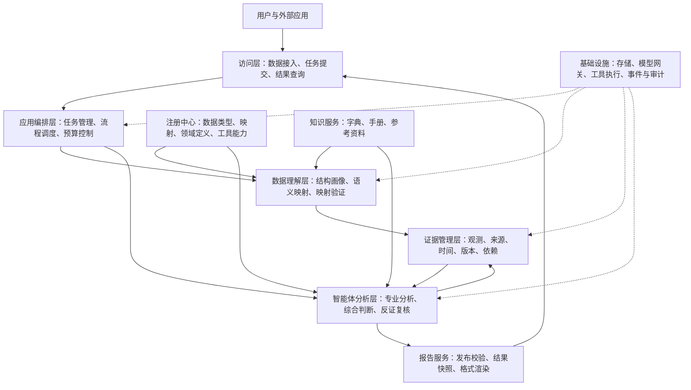
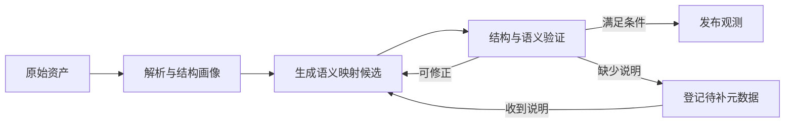
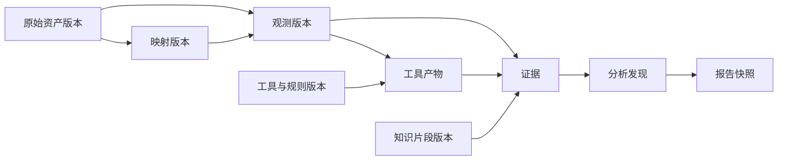
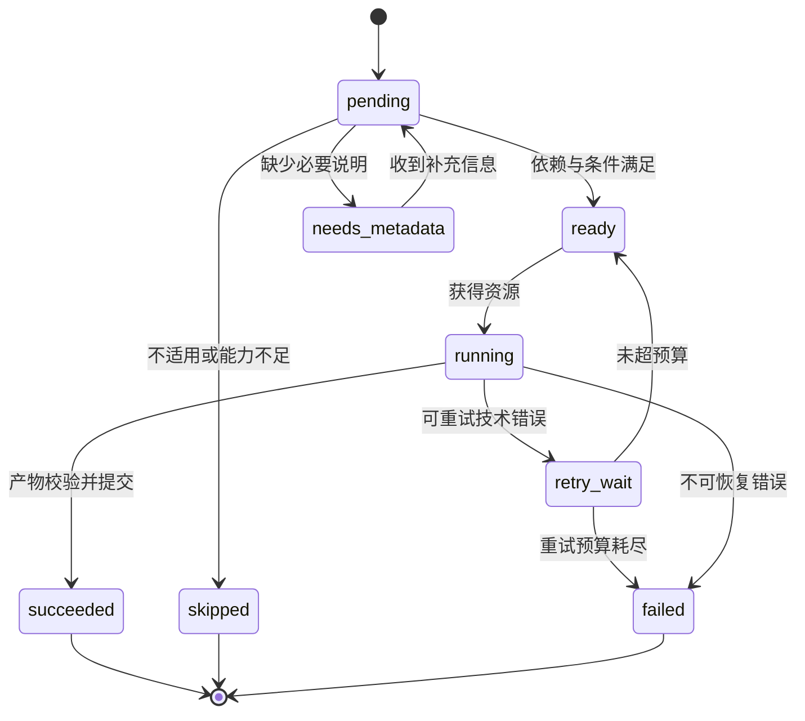
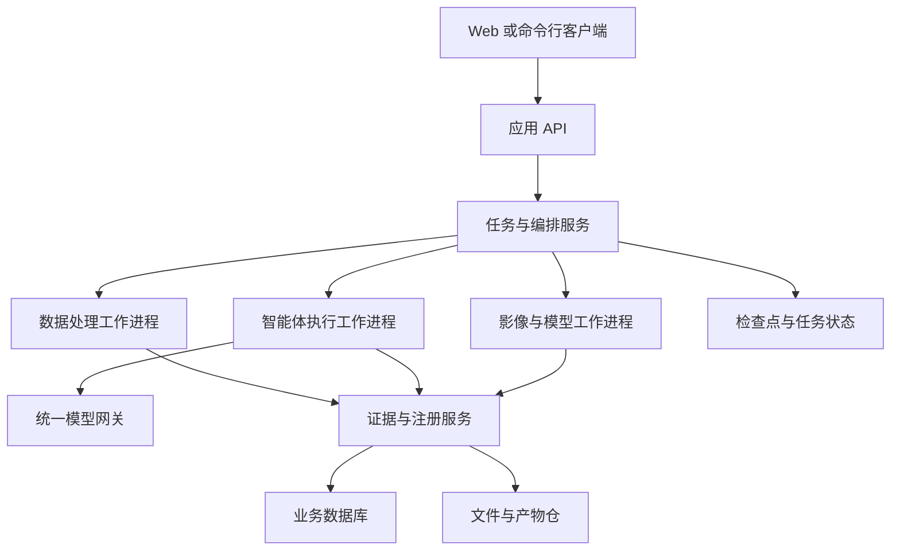

# 面向多源异构数据的多智能体协作系统架构设计

## 1. 系统定位与设计目标

本系统面向量表、检测结果、遗传信息、医学影像和临床文本等多种数据类型，支持字段名称、组织层级、记录布局和来源格式可变的数据接入，通过语义适配、证据管理、任务规划和多智能体协作，形成可追溯的分析结果。

系统以分析任务为入口，以证据为智能体之间的信息交换单位，以工具能力和数据适用条件约束执行过程。

核心设计目标如下：

| 目标 | 架构要求 |
|---|---|
| 输入结构可变 | 数据来源结构与分析逻辑解耦，通过版本化映射连接 |
| 数据语义明确 | 区分原始值、标准概念、计分规则及解释条件 |
| 协作按需发生 | 根据任务目标、证据缺口和分歧安排专业分析与复核 |
| 结果能够追溯 | 每项发现能够定位到原始记录、转换步骤和工具版本 |
| 不确定性可管理 | 对语义歧义、数据缺失和分析分歧显式建模 |
| 能力可扩展 | 新来源、新量表和新模型通过注册接口接入 |
| 执行可恢复 | 支持任务检查点、幂等提交、局部重试与增量重算 |

### 1.1 数据支持边界

系统区分三种接入情形：

1. **语义已知、结构变化**：通过映射适配不同字段和布局，复用同一分析能力。
2. **新业务对象、有明确说明**：根据量表手册或数据字典登记定义，再匹配可用工具。
3. **结构可读、语义不足**：保存数据并提供结构、完整性和可用性分析；无法确认的含义保留为待解析状态。

数据接入成功、字段映射成功、满足分析条件是三个独立状态。系统不会因为文件能够解析，就默认其中所有数据可以用于解释或推断。

## 2. 总体架构

系统采用分层架构，由访问层、应用编排层、数据理解层、证据管理层、智能体分析层和基础设施层组成。



### 2.1 各层职责

| 层次 | 主要组件 | 核心职责 |
|---|---|---|
| 访问层 | 文件接口、数据源接口、任务接口、查询接口 | 接收数据和目标，展示运行状态、待补信息和结果 |
| 应用编排层 | 任务服务、规划器、调度器、状态机 | 管理依赖、并行、资源、重试、复核与终止 |
| 数据理解层 | 解析器、结构画像、映射智能体、验证器 | 将可变源结构转换为具有明确语义的观测 |
| 证据管理层 | 观测仓、证据仓、来源索引、版本与依赖服务 | 保存可追溯事实，提供一致的分析快照 |
| 智能体分析层 | 专业智能体、协调智能体、综合智能体、反证智能体 | 分析证据、提出发现、定位问题并组织复核 |
| 基础设施层 | 对象存储、数据库、执行进程、模型网关、日志 | 提供持久化、资源隔离、外部调用与运行记录 |

层间通过类型化对象交互。分析智能体不能直接修改原始数据，也不承担原始数据库字段解释的职责。

### 2.2 数据平面与控制平面

**数据平面**管理数据资产、映射、观测、证据、工具结果和报告快照，负责事实的一致性与追溯。

**控制平面**管理分析目标、任务依赖、执行计划、质询、预算和任务状态，决定何时调用哪一种能力。

控制平面主要传递数据引用和摘要；大文件、影像和完整记录保存在数据平面，按需查询。

## 3. 双闭环运行机制

### 3.1 数据理解闭环



该闭环解决记录在哪里、字段代表什么、单位与时间如何解释等问题。验证按字段或记录分组处理，允许部分数据发布、部分数据等待说明。

### 3.2 分析协作闭环


该闭环解决证据支持什么、哪些发现存在问题、下一步应补查什么。若分歧来自字段语义或数据关联，复核任务可回到数据理解闭环；修订通过验证后，再触发受影响的分析任务。

两个闭环分别维护版本和执行状态，避免分析过程修改映射后直接继续使用过期结论。

## 4. 数据接入与结构适配

### 4.1 输入清单

一次接入请求使用 `InputManifest` 描述：

- 项目与数据集标识。
- 数据资产的位置、格式、内容指纹和来源系统。
- 可选的数据类型提示、量表名称、版本及字典附件。
- 患者与访视关联信息。
- 数据可用时间、取得时间与访问范围。

一个请求可包含多个表、文件或影像目录。数据类型提示是可核验的输入线索，不直接覆盖解析和验证结果。

### 4.2 格式解析器

解析器将文件转换为保留来源结构的 `ParsedDocument`，并记录源位置。

| 输入 | 保留的信息 |
|---|---|
| CSV / Excel | 表名、工作表、表头层级、行列位置、单元格原值 |
| JSON | 对象路径、数组位置、键名、原始值和嵌套关系 |
| 数据库 / 业务 API | 来源命名空间、表单标识、字段元数据、记录键 |
| 文本 / PDF | 文档、页码、段落、字符区间、抽取方式 |
| 影像 | 文件引用、检查与序列标识、采集元数据、空间信息 |

扫描件和复杂表格需要对应的 OCR 或表格抽取能力；未配置该能力时返回格式能力不足状态，不发布空文本为成功结果。

### 4.3 结构画像

`SourceProfiler` 通过程序统计形成 `SourceProfile`：

- 字段路径、声明类型与观测类型。
- 缺失率、重复率、数值范围、分类取值与异常格式。
- 主键候选、关联键候选、连接基数。
- 宽表、长表、重复字段组、嵌套数组和访视布局。
- 量表、单位、版本、标本和日期角色等元数据线索。
- 结构指纹及语义元数据指纹。

大规模数据采用分块画像。智能体读取有代表性的样本和统计摘要；完整验证由程序扫描数据执行。

### 4.4 语义映射

映射智能体接收结构画像、字典、领域定义和映射注册表，生成 `MappingSpec`。

映射方案描述：记录选择与展开方式、主体键、事件键、字段到概念的对应关系、值转换、时间解释、来源定位和适用条件。

映射执行器仅执行注册算子：

| 算子 | 用途 |
|---|---|
| `select` | 提取列或对象路径 |
| `explode` | 展开嵌套记录数组 |
| `unpivot` | 将访视列或项目列转换为长表 |
| `join` | 按明确键和连接基数关联记录 |
| `parse_number` | 解析数值，同时保留比较符号与缺失原因 |
| `parse_date` | 按指定格式解释日期和精度 |
| `map_enum` | 根据字典转换选项编码 |
| `convert_unit` | 按明确量纲和换算规则转换单位 |

映射候选不包含任意可执行代码。无法由注册算子表达的转换通过独立插件扩展，并声明输入、输出和验证规则。

### 4.5 映射验证与复用

验证包含两个方面：

**结构验证**检查类型、范围、记录数量、主键、展开结果、关联基数、解析失败和未映射字段。

**语义验证**检查量表身份、总分与分项、测量时间与录入时间、原始分与校正分、标本与平台等对应关系。

映射状态为：`proposed`、`validated`、`active`、`needs_metadata`、`suspended`。已验证映射只有满足接入策略和适用条件后，才能进入可复用状态。

复用键包含来源、项目、结构指纹、量表版本和关键元数据。每个新批次继续执行校验；即使列名未变，单位、编码、版本或数据分布发生异常变化，也要重新验证。

## 5. 统一语义模型

统一语义模型采用“公共核心 + 类型扩展”。公共核心固定身份、来源、时间和版本，类型扩展表达量表、检测、影像及文本的专有属性。

### 5.1 核心对象

| 对象 | 职责 | 核心字段 |
|---|---|---|
| `SourceAsset` | 描述原始数据资产 | 来源、URI、hash、格式、取得时间 |
| `MappingSpec` | 描述适配方案 | 选择器、算子、目标概念、条件、版本 |
| `SubjectLink` | 描述跨来源主体对应 | 来源主体键、统一主体引用、关联依据 |
| `Observation` | 表达一次测量或抽取结果 | 主体、概念、值、时间、上下文、来源 |
| `AssessmentInstance` | 表达一次量表测评 | 量表版本、条目、总分、计分与校正信息 |
| `ImagingAsset` | 表达一次影像资产 | 检查、序列、模态、采集条件、文件引用 |
| `Evidence` | 提供推理依据 | 观测或产物引用、生成方式、适用范围 |
| `Finding` | 表达分析发现 | 命题、支持与反对证据、假设、限制 |
| `Task` | 表达可执行工作 | 目标、能力、输入、依赖、预算、状态 |
| `Challenge` | 表达针对发现的质疑 | 目标发现、问题类型、证据、复核请求 |
| `ReportSnapshot` | 固化发布结果 | 发现版本、证据快照、限制、运行版本 |

### 5.2 Observation

`Observation` 不依赖原始字段名称。以下为虚构 XX 量表的数据示例，假定字段含义已有说明支持：

```json
{
  "observation_id": "obs-001",
  "revision": 1,
  "subject_ref": "project-a:subject-001",
  "assessment_ref": "assessment-001",
  "data_type": "assessment",
  "concept_id": "instrument.xx.v1.total.raw",
  "value": {"kind": "number", "number": 18, "unit": "score"},
  "event_time": {
    "value": "2026-06-01",
    "precision": "day",
    "role": "measurement"
  },
  "qualifiers": {
    "instrument_id": "xx",
    "instrument_version": "v1",
    "score_kind": "raw"
  },
  "lineage": {
    "source_id": "source-001",
    "record_locator": "sheet:assessment/row:2",
    "value_locator": "column:总分",
    "mapping_id": "mapping-001",
    "mapping_version": "1"
  },
  "validation": {
    "mapping_status": "validated",
    "interpretation_status": "rules_missing"
  }
}
```

同一语义可以由 `总分`、`total_score` 或嵌套的 `result.total` 映射得到；每条来源记录保留自己的身份与定位。值相同不构成合并记录的充分条件。

值对象采用带类型的结构，支持数值、分类、区间、文本、比较符号、缺失原因和资产引用。未知值、未测量、不适用与数值零分别表示。

### 5.3 AssessmentInstance

一次量表测评包含主体、测量时间、量表名称与版本、语言、施测条件、条目观测和分数观测。

条目、分项、总分、备注与施测元数据具有不同角色。原始报告分、程序计算分和校正分分别保存，并通过派生关系关联。

缺少版本或计分说明时，可以呈现原始报告分，但不自动应用其他版本的计分或解释规则。

### 5.4 身份与时间

主体标识采用项目及来源命名空间。跨来源身份关联使用明确映射或可验证的连接键，并记录依据；待确认关联不进入跨源综合。

时间模型分别记录测量、采样、录入、报告、取得和可用时间。日期精度支持年、月、日和时间戳；相对访视在缺少锚点时保持相对表示。

分析请求可指定 `as_of`。系统同时限制原始记录与派生产物的可用时间，避免后续数据进入较早时点的分析快照。

## 6. 注册中心

### 6.1 数据类型注册表

描述数据类型的公共属性、扩展协议、格式解析器和基础校验规则。初始类型包括量表、实验室检测、遗传、影像、临床文本和访视元数据。

### 6.2 领域定义注册表

量表定义 `InstrumentSpec` 包含：

- 名称、别名、版本、语言和测量领域。
- 题目与维度、响应编码、反向计分和分数类型。
- 计算公式、缺项策略、校正条件及有效范围。
- 分数方向、解释规则和适用人群。
- 版本间可比性及合法换算关系。
- 定义来源、状态和修订记录。

实验室指标定义补充标本、方法、平台、单位和参考条件；影像定义补充模态、序列、示踪剂及空间与预处理要求。

知识检索产生的规则先作为候选，经过来源和适用性核验后才能成为可执行定义。

### 6.3 工具能力注册表

每项工具能力由 `CapabilitySpec` 描述：

```text
能力标识与版本
输入类型与前置条件
输出协议
参数约束
模型与预处理版本
资源类型、并发限制、超时
失败码与重试策略
可用状态与验证状态
```

典型能力包括量表校验、计分、序列描述、纵向比较、影像预测、文本观测抽取和知识检索。

新量表优先增加领域定义，复用通用计分与分析工具；特殊算法使用插件。新来源增加映射，新模型增加能力注册，三种扩展互不替代。

## 7. 证据管理架构

### 7.1 观测、证据与发现

系统区分：

- **观测**：记录中报告的值或从文本抽取的信息。
- **工具产物**：基于输入运行计算或模型得到的结果。
- **证据**：可供分析引用的观测、工具产物或知识片段。
- **发现**：智能体基于证据形成的具体命题。

模型预测具有模型适用范围和误差，文本抽取具有抽取不确定性，文献知识具有适用条件。它们不能因为都进入证据仓就被视为同等可靠的事实。

### 7.2 来源关系与依赖



多个 Agent 引用同一来源，不会增加独立证据数量。来源关系支持识别共同输入、重复记录和相关模型输出。

### 7.3 快照与修订

每次运行绑定不可变输入快照，记录资产、映射、规则、工具和模型版本。修订产生新版本，通过 `supersedes` 指向旧版本。

新版本提交后，依赖服务查找受影响的工具产物和发现，将其标记为待重算。重算形成新的分析快照，已发布报告保留原有引用。

### 7.4 查询接口

证据查询支持主体、概念、时间、量表版本、单位、来源、有效性和依赖过滤。精确事实查询使用结构化索引；语义检索用于寻找文本与知识候选。

查询结果包含覆盖摘要，说明取得了哪些来源、遗漏了哪些部分以及筛选条件。上下文压缩保留结论、关键数值、证据引用和限制，完整依据可按引用再次读取。

## 8. 智能体角色与权限

| 智能体 / 服务 | 主要输入 | 主要输出 | 职责边界 |
|---|---|---|---|
| 数据理解智能体 | 结构画像、字典、领域定义 | 映射候选与语义疑问 | 不直接发布未验证观测 |
| 映射验证服务 | 候选映射、原始数据、约束 | 验证结果与问题定位 | 程序校验与语义复核分开记录 |
| 协调智能体 | 目标、证据目录、能力清单 | 计划、任务和复核决策 | 不能绕过工具前置条件 |
| 量表分析智能体 | 测评实例、计分定义 | 分数核验、维度发现 | 数值计算通过工具执行 |
| 纵向分析智能体 | 可比较的观测序列 | 变化、趋势和时间限制 | 不合并缺乏可比依据的序列 |
| 检测与遗传分析智能体 | 结果、平台和上下文 | 指标发现与解释条件 | 不补造阈值或平台信息 |
| 影像分析智能体 | 合格影像资产与模型能力 | 模型结果、输入质量和限制 | 文件存在不等于输入兼容 |
| 文本分析智能体 | 文本与源位置 | 含时间、主体和否定信息的观测 | 抽取结果需要校验与来源引用 |
| 知识智能体 | 精确问题和适用上下文 | 规则候选、出处与适用条件 | 不把参考知识当患者观测 |
| 综合分析智能体 | 专业发现、证据覆盖 | 分维度候选结论 | 不按角色数量投票生成诊断 |
| 反证审查智能体 | 候选发现及相关证据 | 具体质询和复核请求 | 每项质疑应可定位或可执行 |
| 发布校验服务 | 候选结论与证据快照 | 可发布报告 | 校验失败项退回修订或保留限制 |

智能体通过证据查询和任务接口获取数据，通过提交接口返回产物。原始数据仓为只读；业务写入由证据服务验证并提交。

## 9. 任务规划与执行

### 9.1 分析请求

`AnalysisRequest` 定义主体范围、分析目标、时间范围、允许能力、预算和输出要求。

目标分为数据盘点、单次分析、纵向比较与多源综合。每种目标对应不同的必要输入条件，数据缺失按具体目标评估。

### 9.2 计划生成

规划器依次完成：

1. 查询目标对应的证据与覆盖情况。
2. 识别语义未决、数据不足和能力不足。
3. 从能力注册表选择可以执行的分析。
4. 形成任务依赖图，并标记必需和可选任务。
5. 为任务分配资源、调用和时间预算。

协调智能体可以提出计划；计划验证器检查依赖是否成环、输入是否合格、工具是否存在、参数是否允许和预算是否满足。

### 9.3 任务状态



运行级另外提供取消与超时控制，停止尚未完成的任务，并将已提交产物保留在运行记录中。

### 9.4 并行与资源调度

不存在数据依赖的专业任务可并行。量表计算和检测分析可以独立执行；综合分析等待必需任务完成或进入明确终态。

调度器按 CPU、GPU、模型 API 和外部服务分别维护并发限制。大模型重试、影像重试和语义复核使用不同预算，避免一个失败分支消耗全部资源。

## 10. 协作与定向复核

### 10.1 Finding 协议

```json
{
  "finding_id": "finding-001",
  "revision": 1,
  "claim": "两次测评的报告分数相差 3 分",
  "scope": {
    "subject_ref": "project-a:subject-001",
    "concept_id": "instrument.xx.v1.total.raw"
  },
  "supporting_evidence_ids": ["evidence-001", "evidence-002"],
  "opposing_evidence_ids": [],
  "assumptions": [],
  "limitations": ["量表解释规则尚未确认"],
  "status": "tentative",
  "requested_checks": ["确认两次计分类型和施测版本是否一致"]
}
```

命题应尽量具体。数值变化、变化方向的含义和临床解释分别表示，避免一次推断跨越多个未经核验的条件。

### 10.2 分歧分类与路由

| 分歧类别 | 示例 | 复核路径 |
|---|---|---|
| 语义映射 | 分项被识别为总分 | 映射复核 |
| 计分规则 | 原始分与校正分混用 | 量表工具和定义查询 |
| 身份关联 | 不同患者记录被关联 | 身份解析服务 |
| 时间可比性 | 不同阶段记录直接比较 | 时间对齐与纵向分析 |
| 指标可比性 | 不同平台或单位混用 | 检测规则核验 |
| 模型输入 | 影像序列或模态不适用 | 影像输入验证 |
| 解释分歧 | 同证据产生不同候选解释 | 综合分析和反证审查 |
| 证据缺失 | 没有评分说明或必要记录 | 检索、补充说明或保留限制 |

### 10.3 复核选择

协调器根据结论影响范围、问题严重程度、可解决性和预计成本安排复核。硬性输入错误优先；没有工具或资料能够处理的问题进入待补状态。

一次复核任务必须明确：被质疑的发现、涉及证据、目标能力、需要回答的问题和完成条件。复核结果为解决、部分解决或未解决，并附新证据和原因。

### 10.4 不确定性传播

系统分别保存映射歧义、测量质量、模型限制和解释分歧，不压缩成一个通用置信分数。

依赖未验证映射的结论不能成为正式支持结论；未校准的模型概率保持模型输出身份；缺失证据不能被描述为阴性证据。

综合分析通过依赖关系继承相关限制，并根据已解决的复核更新发现版本。

### 10.5 终止规则

协作在以下条件下结束相应分支：问题已解决、没有新证据或可执行动作、等待必要说明、达到预算或出现不可恢复失败。

相同质疑、相同输入版本和相同能力组合构成重复复核键。没有新增信息时，不允许重复产生同一任务。

运行结果分为完成、带限制完成、等待说明和失败。带限制完成的报告必须指出哪些目标未得到回答。

## 11. 知识服务与报告服务

### 11.1 知识服务

知识服务管理字典、量表手册、检测说明和参考资料，记录文档版本、章节、页码和适用范围。

检索返回候选片段与来源。知识智能体提取规则及适用条件，领域定义服务决定是否将规则登记为可执行版本。资料更新会触发相关规则的重新验证。

### 11.2 报告服务

报告结构包含：任务范围、数据覆盖、标准观测摘要、专业发现、综合结论、复核过程、未解决问题和证据引用。

发布前执行：

- 引用存在性与版本一致性检查。
- 数值、单位、日期和主体一致性检查。
- 关键结论的证据覆盖检查。
- 被撤回或过期发现排除。
- 未决问题和数据缺口保留检查。
- 解释与证据支持关系审查。

程序能够校验形式和确定性事实；语义支持审查单独记录结论与限制，不宣称形式校验已经保证解释完全正确。

报告先生成统一快照，再渲染为 JSON、Markdown 或其他形式，所有输出格式共享同一组已发布发现。

## 12. 持久化与一致性

### 12.1 存储划分

| 存储 | 内容 |
|---|---|
| 原始资产仓 | 文件快照、影像、原始 API 响应及内容指纹 |
| 业务数据库 | 主体关联、映射、观测、证据、发现、规则版本 |
| 运行状态库 | 计划、任务、检查点、预算与重试信息 |
| 知识索引 | 文档片段、来源元数据及语义检索索引 |
| 产物仓 | 工具输出、报告快照和模型中间产物 |

逻辑存储可共享物理数据库，但业务事实、运行检查点和知识索引保持独立协议与生命周期。

### 12.2 提交与幂等

执行器先将工具产物写入临时位置，验证后由证据服务以事务提交元数据与引用，并更新任务状态。文件提交与数据库提交不能完全原子化时，通过待提交记录和恢复检查处理中断。

工具允许重复执行，但业务产物按幂等键去重。幂等键包含任务、输入版本、能力版本和参数。外部副作用工具须独立声明幂等机制，检查点恢复不代表副作用天然只执行一次。

### 12.3 缓存与增量更新

缓存键包含输入内容指纹、映射与规则版本、工具与模型版本、预处理版本和参数。LLM 结果补充模型配置和提示词版本。

数据或规则修订后，依赖服务只重算受影响的产物。历史快照不变，新结果通过版本关系关联，保证每次分析能够说明实际使用了哪些输入。

## 13. 接口架构

| 接口 | 作用 |
|---|---|
| `POST /datasets` | 提交输入清单并登记资产 |
| `GET /datasets/{id}/profile` | 查询结构画像与数据覆盖 |
| `GET /datasets/{id}/mappings` | 查询映射候选、验证结果与歧义 |
| `POST /datasets/{id}/metadata` | 补充字段、量表或身份说明 |
| `POST /analysis-runs` | 提交分析目标并绑定输入快照 |
| `GET /analysis-runs/{id}` | 查询运行状态、预算与子任务 |
| `POST /analysis-runs/{id}/resume` | 按指定补充信息或修订快照恢复运行 |
| `POST /analysis-runs/{id}/cancel` | 取消运行 |
| `GET /analysis-runs/{id}/challenges` | 查询质询和复核结果 |
| `GET /analysis-runs/{id}/report` | 获取指定版本报告 |
| `GET /evidence/{id}` | 查询证据及来源与派生关系 |

所有接口按项目和主体范围鉴权。变更接口接受请求幂等键，返回稳定的资产、任务或运行标识。

## 14. 部署与运行架构

系统采用模块化应用服务，计算密集型能力通过工作进程执行。



模型网关统一处理超时、重试、调用记录、结构化输出解析和预算计量。工具工作进程限制资源、可访问文件和执行能力。

单机部署可使用本地文件与嵌入式数据库；多用户部署将业务数据与任务状态放入共享数据库，大文件放入共享对象仓，并由任务队列协调工作进程。

## 15. 可观测性与访问控制

每次运行记录资产解析、映射候选、验证、任务调度、工具调用、发现修订、质询处理和报告发布事件。

事件携带 `project_id`、`run_id`、`task_id`、主体范围、输入版本、输出引用、耗时、调用成本及错误码。业务日志不记录凭据，原始敏感数据采用受控引用。

访问控制区分原始资产读取、规则管理、运行执行和报告查询。临床文本、文件内容和检索资料作为数据输入，不能改变智能体权限、注册工具范围或系统指令。

## 16. 完整运行时序

1. 用户提交多份数据资产、必要说明和分析目标。
2. 接入服务保存原始快照，生成结构画像。
3. 映射服务检索适用方案，必要时由数据理解智能体提出新映射。
4. 验证服务发布可用观测，登记尚未解决的语义问题。
5. 身份和时间服务建立可比较的数据范围，生成证据快照。
6. 协调智能体匹配能力并生成任务依赖图，计划验证器检查执行条件。
7. 调度器运行专业智能体及工具，证据服务验证并提交产物。
8. 综合智能体形成具体发现，反证智能体提出可定位的质询。
9. 协调器选择有价值且可执行的复核，必要时返回映射或知识服务。
10. 修订证据触发局部重算，综合发现更新版本。
11. 达到结束条件后，发布服务形成报告快照，保留限制和未解决事项。
12. 用户查询报告中的任一发现，可沿引用关系追溯到原始资产与完整处理路径。
